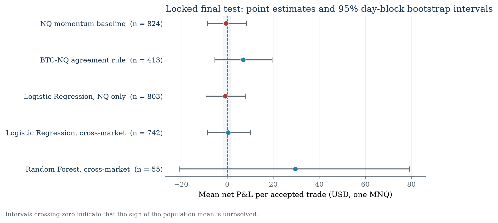
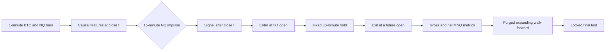
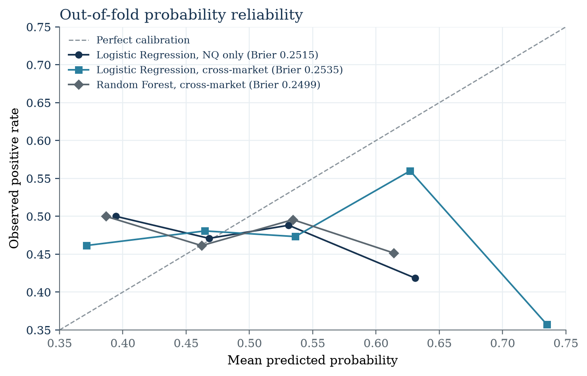

# BTC–NQ Cross-Market Signal Validation


[](https://github.com/cliprob/BTC-NQ-Cross-Market-Validation/actions/workflows/ci.yml)


> **Research question:** Do BTC-derived features add predictive value over a comparable NQ-only momentum baseline after realistic MNQ costs?

This repository is a leakage-aware model-validation study, not a profitable-algorithm claim. It rebuilds earlier notebook research as a causal, event-driven pipeline with next-open execution, non-overlapping positions, purged walk-forward validation, realistic costs, and an immutable final-test lock.

**Locked conclusion:** no evaluated strategy satisfies the prespecified positive-edge criterion. The BTC–NQ agreement rule has an economically interesting positive point estimate, but its confidence interval includes zero.



## Results at a glance

The configuration and implementation were frozen before the final period, `2026-01-01` through `2026-05-12`, was opened. The test produced 824 non-overlapping candidate events.

| Locked strategy | Trades | Gross USD | Net USD | Mean net USD | 95% day-block bootstrap CI |
|---|---:|---:|---:|---:|---:|
| NQ momentum baseline | 824 | 2,149.50 | -322.50 | -0.39 | [-8.62, 8.49] |
| BTC–NQ agreement rule | 413 | 4,136.50 | 2,897.50 | 7.02 | [-5.35, 19.49] |
| Logistic Regression, NQ only | 803 | 1,782.50 | -626.50 | -0.78 | [-9.21, 8.05] |
| Logistic Regression, cross-market | 742 | 2,610.50 | 384.50 | 0.52 | [-8.54, 10.13] |
| Random Forest, cross-market | 55 | 1,795.00 | 1,630.00 | 29.64 | [-20.83, 79.09] |

A positive edge required at least 50 final-test trades, positive net P&L, and a positive lower confidence bound. Every interval crosses zero. Positive point estimates are therefore follow-up hypotheses, not evidence of deployable alpha.

The full seven-page research note is available as [`report/main.pdf`](report/main.pdf), with its LaTeX source versioned beside it.

## Research design



The maintained pipeline applies the following controls:

1. NQ timestamps are localized with `America/Chicago`, converted through UTC, and evaluated in `America/New_York` using CME Equity trading dates.
2. Features are available at minute `t` close. Entry is `t+1` open; exit is a future open.
3. Events crossing a missing bar, contract roll, day boundary, or session end are excluded.
4. A global cooldown permits one position at a time, preventing overlapping labels and trades.
5. Expanding quarterly folds use a purge longer than the holding horizon.
6. Scaling, model fitting, feature diagnostics, and probability selection occur inside the appropriate folds.
7. A versioned manifest locks settings, hashes, data dates, trial count, and selected thresholds before final evaluation.

## Research specification and provenance

The numeric choices are not presented as laws of the market. Some are market mechanics, one is fitted on training data, and several are frozen heuristics inherited from earlier exploratory work.

| Parameter | Status | Rationale and limitation |
|---|---|---|
| 15-minute NQ momentum | Frozen heuristic | Short-horizon impulse inherited from earlier 15/30-minute experiments; not proven optimal. |
| 70th-percentile impulse | Train-fitted threshold | Retains an analyzable event count while selecting above-typical moves. The percentile itself remains a design choice. |
| 55-minute coherence window | Frozen heuristic | Prior research compared 55 and 90 minutes. The clean pipeline does not establish 55 as uniquely correct. |
| Spearman ≥ 0.30 | Frozen heuristic | Pragmatic positive-association cutoff, not an estimated economic boundary. |
| Directional hit ratio ≥ 0.60 | Frozen heuristic | Requires same-sign moves in a clear majority of minutes; not statistically identified as optimal. |
| Fixed hold 30 minutes | Frozen heuristic | Represents short-lived continuation and is a benchmark, not a validated optimal exit. |
| Minimum 50 trades | Research guardrail | Prevents claims from extremely small samples; not a formal power calculation. |
| Purge 60 minutes | Validation control | Exceeds the 30-minute label horizon and separates training labels from fold boundaries. |
| Next-open fills and roll/session checks | Market mechanics | Enforce causal and executable event paths. |

Legacy research tested broader parameter families, including 55/90-minute correlation windows, multiple holding horizons, and correlation-decay exits. Those experiments explain provenance but are not treated as clean sensitivity evidence because the old backtest contained material execution and overlap errors.

## Does the hypothesis have potential?

The answer is **possibly, but not yet demonstrated**:

- The interpretable BTC–NQ rule earned `$7.02` per accepted trade over 413 final-test trades.
- Its 95% interval, `[-$5.35, $19.49]`, still admits both loss and gain.
- Cross-market Logistic Regression did not materially improve upon the NQ-only ablation.
- The Random Forest estimate is positive but based on only 55 trades with a very wide interval.

The defensible next questions are whether results are stable across `30/55/90`-minute coherence windows, whether coherence decay can inform a causal dynamic exit, whether impulse magnitude has a monotonic relationship with subsequent returns, and whether long and short events behave differently. These require a new versioned hypothesis and a new untouched evaluation period.

## Model diagnostics



OOF Brier scores are `0.2515` for NQ Logistic Regression, `0.2535` for cross-market Logistic Regression, and `0.2499` for the constrained Random Forest. Predictions cluster close to an uninformative balanced forecast. Coefficients and permutation importance are retained as predictive diagnostics, not causal interpretations.

## What this project demonstrates

- Event-driven backtesting with causal next-open execution
- Futures contract economics, sessions, DST, rolls, and gap handling
- Non-overlapping events and purged expanding walk-forward validation
- NQ-only ablation against rule-based and ML cross-market models
- OOF calibration, Brier score, PSI drift, and day-block bootstrap uncertainty
- Trial logging, frozen research manifests, deterministic tests, typing, and CI
- Honest reporting of an inconclusive result after costs

## What it does not claim

- No validated positive alpha
- No causal proof that BTC leads Nasdaq futures
- No optimality claim for the 15/30/55-minute horizons or 0.30/0.60 thresholds
- No live- or paper-trading readiness
- No QuantConnect integration

## Audit of the legacy research

The earlier notebook results were dominated by backtest mechanics:

- 258,207 trades generated 14,554 NQ points in one replay: only 0.056 point per trade before costs.
- A later ML notebook averaged 0.075 point per trade, below one 0.25-point MNQ tick.
- Candidate returns overlapped, fills used a close needed to form the signal, and gaps or rolls were not consistently excluded.
- Fixed UTC offsets mishandled DST, while model and threshold selection could use final-period information.
- Per-trade observations were annualized using an invalid Sharpe convention.
- An intermediate ranking could reward `profit_factor = inf` configurations with one to three validation trades.

Historical notebooks, prototype modules, figures, and the old QuantConnect draft remain under [`legacy/`](legacy/) for authorship and auditability. Their displayed metrics are not source-of-truth results.

## Costs and data

The locked scenario represents one MNQ contract: `$2 × index`, a `0.25`-point tick worth `$0.50`, one tick of slippage per side, and `$1` commission per side (`$3` round trip). Contract specifications come from [CME](https://www.cmegroup.com/markets/equities/nasdaq/micro-e-mini-nasdaq-100.html); commissions are configurable and should be checked against the current [IBKR schedule](https://www.interactivebrokers.com/en/pricing/commissions-futures.php).

Raw data are intentionally absent from Git. The expected schemas are documented in [`data/README.md`](data/README.md). NQ data must be supplied locally as one-minute OHLCV bars with a contract identifier and are never redistributed.

Download public Binance USD-M BTCUSDT bars:

```bash
python data/download_binance.py \
  --start 2024-03-07 --end 2026-05-13 \
  --output data/raw/BTCUSDT_um-futures_1m.csv
```

## Reproduce the pipeline

Requires Python 3.11+.

```bash
python -m pip install -e ".[dev]"
cp configs/research.yaml configs/research.local.yaml
# edit only local BTC/NQ paths and output directory
python -m cross_market.run --config configs/research.local.yaml --stage validation
python -m cross_market.run --config configs/research.local.yaml --stage final
```

The final command verifies configuration and source hashes against the validation lock. It refuses an already evaluated final period unless `--force` is supplied; that override exists for auditing, not ordinary research.

Generate the publication figures from the committed frozen JSON artifacts:

```bash
python report/generate_figures.py
```

Run quality checks:

```bash
python -m ruff check .
python -m ruff format --check cross_market tests data/download_binance.py
python -m mypy cross_market
python -m pytest
```

## Repository map

```text
cross_market/       maintained event, validation, model, metric, and artifact code
configs/            public research configuration; local path override is ignored
data/               schema, Binance downloader, and no proprietary datasets
notebooks/          thin, import-only research summary
tests/              unit, regression, notebook-smoke, and integration coverage
outputs/portfolio/  frozen manifest, trial ledger, metrics, and original figures
report/              academic LaTeX/PDF note and figures generated from locked JSON
cv/                  updated LaTeX CV source
legacy/              original notebooks and prototypes; not source of truth
```

Key reproducibility artifacts:

- [`validation_manifest.json`](outputs/portfolio/validation_manifest.json): locked settings, OOF diagnostics, trial count, hashes, and final-result identity.
- [`trial_ledger.csv`](outputs/portfolio/trial_ledger.csv): every feasible probability-threshold comparison.
- [`final_results.json`](outputs/portfolio/final_results.json): final metrics, uncertainty intervals, verdicts, calibration, and PSI drift.

Selection-bias discussion follows the [Deflated Sharpe Ratio](https://papers.ssrn.com/sol3/papers.cfm?abstract_id=2460551) and [Probability of Backtest Overfitting](https://papers.ssrn.com/sol3/Papers.cfm?abstract_id=2326253) literature.

## Credits

The original coursework was created by Robert Mazurczak and [@AlexSamuseva](https://github.com/AlexSamuseva). The repository remains a fork so upstream lineage and commit authorship stay visible. The leakage-aware validation rebuild and documentation refresh were completed by Robert Mazurczak. No license is added without a joint decision by the authors.
