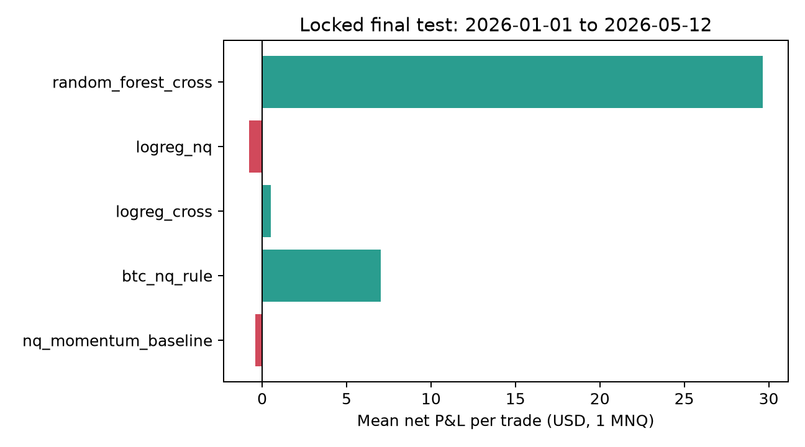

# BTC–NQ Cross-Market Signal Validation

Leakage-aware research into whether Bitcoin features add predictive value for Nasdaq futures events after realistic
MNQ costs. This is a **model-validation project, not a profitable-algorithm claim**.

The original coursework was created by Robert Mazurczak and
[@AlexSamuseva](https://github.com/AlexSamuseva). This repository remains a fork so the upstream lineage and commit
authorship stay visible. The validation rebuild was completed by Robert Mazurczak. No license is added without a
joint decision by the authors.

## Result snapshot

The configuration and implementation were frozen before the final period (`2026-01-01`–`2026-05-12`) was opened.
The test produced 824 non-overlapping candidate events.

| Locked strategy | Trades | Gross USD | Net USD | Mean net USD | 95% block-bootstrap CI |
|---|---:|---:|---:|---:|---:|
| NQ momentum baseline | 824 | 2,149.50 | -322.50 | -0.39 | [-8.62, 8.49] |
| BTC–NQ rule | 413 | 4,136.50 | 2,897.50 | 7.02 | [-5.35, 19.49] |
| Logistic Regression, NQ only | 803 | 1,782.50 | -626.50 | -0.78 | [-9.21, 8.05] |
| Logistic Regression, cross-market | 742 | 2,610.50 | 384.50 | 0.52 | [-8.54, 10.13] |
| Random Forest, cross-market | 55 | 1,795.00 | 1,630.00 | 29.64 | [-20.83, 79.09] |

**Conclusion:** no model meets the prespecified positive-edge rule: at least 50 final trades, positive net P&L, and a
positive lower bound of the 95% day-block bootstrap CI. The positive BTC–NQ rule and Random Forest estimates are
inconclusive, not evidence of deployable alpha.



The full six-page report is in [`report/main.pdf`](report/main.pdf); its LaTeX source is versioned beside it.

## What changed from the legacy research

The audit found that earlier notebook results were dominated by backtest mechanics:

- 258,207 trades generated 14,554 points in one replay—only 0.056 point per trade before costs.
- The later ML notebook averaged 0.075 point per trade, below one 0.25-point MNQ tick.
- Candidate returns and labels overlapped, close prices were used as fills after the close was known, and contract
  rolls or missing bars were not excluded.
- A fixed time offset mishandled DST; model thresholds and winners were selected with final-period information.
- Per-trade observations were annualized with an invalid Sharpe convention.
- An intermediate ranking could promote `profit_factor = inf` configurations with only one to three validation
  trades.

Historical notebooks, prototype modules, figures, and the old QuantConnect draft are retained under
[`legacy/`](legacy/) for attribution. Their displayed metrics are not source-of-truth results.

## Methodology

The research question is deliberately narrow:

> Do BTC-derived features improve predictive value over a comparable NQ-only momentum baseline after costs?

The maintained pipeline applies these controls:

1. NQ timestamps are localized with `America/Chicago`, converted through UTC, and evaluated in
   `America/New_York` using CME Equity trading dates.
2. Features are available at minute `t` close. Entry is `t+1` open; exit is a future open.
3. Events crossing a missing bar, contract roll, day boundary, or session end are excluded.
4. A global cooldown permits one position at a time, so labels and trades do not overlap.
5. Expanding quarterly walk-forward folds use a purge longer than the maximum holding horizon.
6. Scaling, coefficients, and permutation importance are fitted within folds. OOF probabilities drive Brier and
   reliability diagnostics.
7. The NQ-only baseline, BTC–NQ rule, Logistic Regression, and constrained Random Forest are compared. SVM appears
   only in the project history.
8. Threshold selection requires at least 50 validation trades. Profit factor is capped and cannot determine
   feasibility.
9. The versioned manifest locks the sanitized configuration, source hash, event threshold, model thresholds, data
   dates, and trial count before final evaluation.

The cost scenario represents one MNQ contract: `$2 × index`, a `0.25`-point tick worth `$0.50`, one tick of
slippage per side, and `$1` commission per side (`$3` round trip). Contract specifications come from
[CME](https://www.cmegroup.com/markets/equities/nasdaq/micro-e-mini-nasdaq-100.html); commission assumptions are
configurable and should be checked against the current
[IBKR schedule](https://www.interactivebrokers.com/en/pricing/commissions-futures.php).

Selection-bias discussion follows the
[Deflated Sharpe Ratio](https://papers.ssrn.com/sol3/papers.cfm?abstract_id=2460551) and
[Probability of Backtest Overfitting](https://papers.ssrn.com/sol3/Papers.cfm?abstract_id=2326253) literature.

## Quickstart

Requires Python 3.11+.

```bash
python -m pip install -e ".[dev]"
cp configs/research.yaml configs/research.local.yaml
# edit only local BTC/NQ paths and output directory
python -m cross_market.run --config configs/research.local.yaml --stage validation
python -m cross_market.run --config configs/research.local.yaml --stage final
```

The final command verifies the configuration and source hashes against the validation lock. It refuses to rerun an
already evaluated final period unless `--force` is supplied; that override is for auditing, not ordinary research.

Run quality checks with:

```bash
python -m ruff check .
python -m ruff format --check cross_market tests data/download_binance.py
python -m mypy cross_market
python -m pytest
```

## Data access

Raw data are intentionally absent from Git. The expected schemas are documented in [`data/README.md`](data/README.md).

Download public Binance USD-M BTCUSDT bars:

```bash
python data/download_binance.py \
  --start 2024-03-07 --end 2026-05-13 \
  --output data/raw/BTCUSDT_um-futures_1m.csv
```

NQ data must be supplied locally as one-minute OHLCV bars with a contract identifier. The repository does not and
will not publish IBKR-derived market data. Small synthetic CSV fixtures are included solely for tests.

## Repository structure

```text
cross_market/       maintained event, validation, model, metric, and artifact code
configs/            public research configuration; local path override is ignored
data/               schema, Binance downloader, and no proprietary datasets
notebooks/          thin, import-only research summary
tests/              unit, regression, notebook-smoke, and integration coverage
outputs/portfolio/  frozen manifest, trial ledger, metrics, and figures
report/              six-page LaTeX/PDF research report
cv/                  updated LaTeX CV source
legacy/              original notebooks and prototypes; not source of truth
```

## Reproducibility artifacts

- [`validation_manifest.json`](outputs/portfolio/validation_manifest.json): locked settings, OOF results, feature
  diagnostics, trial count, source/config hashes, and final-result hash.
- [`trial_ledger.csv`](outputs/portfolio/trial_ledger.csv): all feasible probability-threshold comparisons.
- [`final_results.json`](outputs/portfolio/final_results.json): untouched-period metrics, block-bootstrap intervals,
  Brier scores, verdicts, and PSI drift diagnostics.
- [`reliability_oof.png`](outputs/portfolio/reliability_oof.png): fold-local probability reliability.

GitHub Actions runs lint, format checks, static typing, `pytest`, notebook smoke validation, and committed-artifact
integrity checks. Full research requires the two local minute-bar datasets and remains an explicit command.

## Skills demonstrated

- Event-driven backtesting with causal execution and non-overlapping labels
- Futures contract economics, session calendars, DST, roll, and gap handling
- Purged expanding walk-forward validation and strict final-test isolation
- Logistic Regression pipelines and constrained Random Forests in scikit-learn
- OOF calibration, Brier score, permutation importance, PSI drift, and block bootstrap
- Selection-bias controls, trial logging, hashed research manifests, testing, typing, and CI

This repository does not include QuantConnect integration and does not claim live- or paper-trading readiness.
